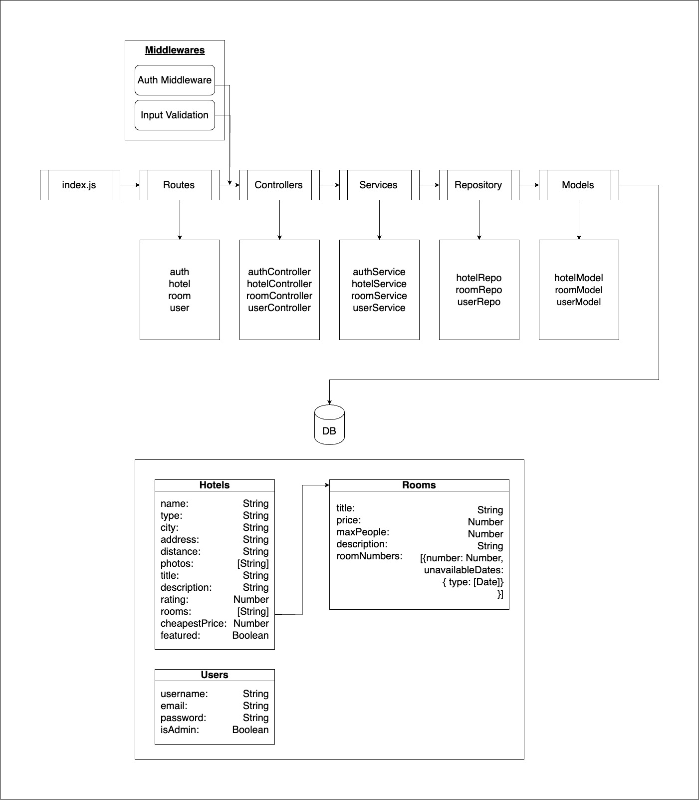
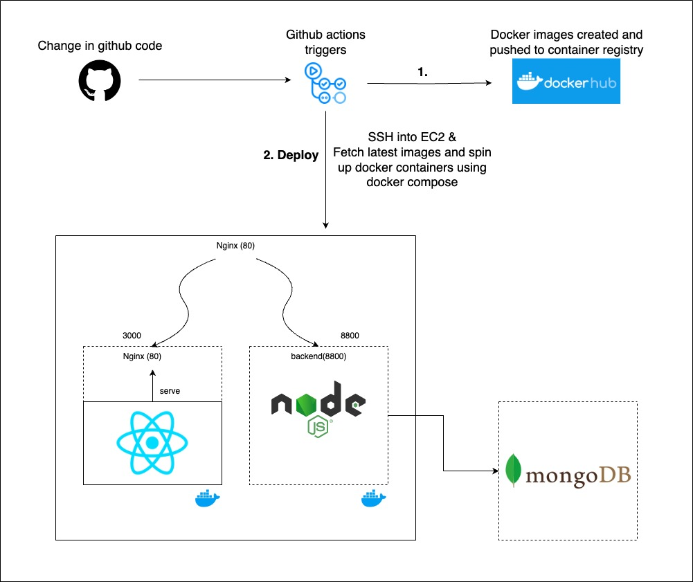

# Stay Spotter - Hotel Booking Service

Welcome to Stay Spotter, a dynamic hotel booking service designed for a global audience that allows users to book rooms worldwide. This project is implemented using the MERN (MongoDB, Express.js, React, Node.js) stack.

## Table of Contents

- [Overview](#overview)
- [Features](#features)
- [Installation](#installation)
- [Usage](#usage)
- [Technologies](#technologies)
- [Backend API Architecture](#backend-api-architecture)
- [CI/CD Flow](#ci-cd-flow)
- [Contributing](#contributing)
- [Design Credits](#design-credits)
- [License](#license)

## Overview

Stay Spotter enables users to search for hotels, input booking details, and reserve rooms. The booking functionality is restricted to registered users.

## Features

- User authentication for secure bookings.
- Hotel search based on location and dates.
- Room reservation system to prevent double bookings.

## Installation

To set up the project locally, follow these steps:

```bash
# Clone the repository
git clone https://github.com/tyagiharsh7/Stay-Spotter.git

# install client dependencies
cd client && npm install 

# install api dependencies
cd api && npm install
```

## Usage

Run the development server:

```bash
# run client server
cd client && npm run dev

# run api server
cd api && npm run dev
```

## Docker

Run using docker-compose:

```bash
docker-compose up -d --build
```

## Technologies

- **Backend**: Express.js, Node, bcryptjs, jsonwebtoken, zod(input sanitization)
- **Frontend**: React, Recoil (state management)
- **Database**: MongoDB
- **CI/CD**: GitHub Actions
- **Containerization**: Docker and Docker Compose
- **Cloud Hosting**: EC2 on AWS

## Backend API Architecture



## CI/CD Flow



## Contributing

If you'd like to contribute, please follow these steps:

1. Fork the project.
2. Create a new branch.
3. Make your changes and commit them.
4. Push to your fork and submit a pull request.

## Design Credits

A big shoutout to this Dribbble designer for their fantastic design elements that I used in Stay Spotter.

- [Lunora Hotel Booking Landing Page](https://dribbble.com/shots/21921721-Lunora-Hotel-Booking-Landing-Page{:target="_blank"})
- [Lunora Detail Page Room](https://dribbble.com/shots/21806496-Lunora-Detail-Page-Room{:target="_blank"})

Do explore more of their work.

## License

This project is licensed under the [MIT License] - see the [LICENSE.md](LICENSE.md) file for details.
